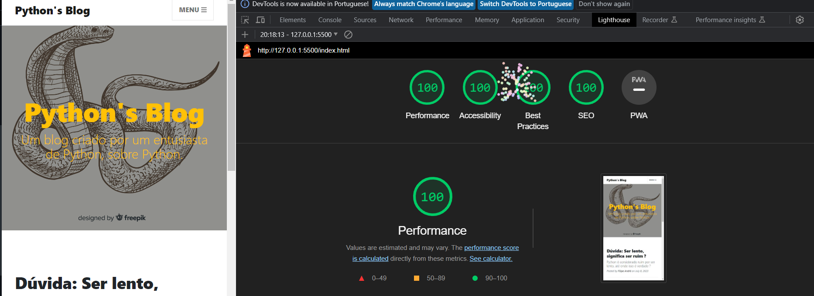

# Primeiro Web App - Coding Mobile

Instruções:

    1.Defina uma problema e uma proposta de solução digital via um webapp

    2.Selecione um template que converse com sua proposta de solução:
    • https://html5up.net/
    • https://startbootstrap.com/themes?showPro=false
    • https://bootstrapmade.com/
    • https://w3layouts.com/

    3.Adapte o template para a sua proposta de solução 
    4.Suba o projeto para o github (https://github.com/) 
    5.Suba o projeto para algum servidor (netlify (https://app.netlify.com/) ou github pages)

Template:

    https://startbootstrap.com/theme/clean-blog

Solução: 

    Python's Blog: blog informativo sobre Python

Deploy da solução:

    https://coruscating-pudding-606193.netlify.app/

Lighthouse do index no pc usando chrome:

Créditos das imagens:

Image by <a href="https://www.freepik.com/free-vector/realistic-hand-drawn-vintage-snake-background_4231030.htm#query=python&position=22&from_view=search&track=sph">Freepik</a>

<a href="https://www.freepik.com/free-vector/application-programming-interface-concept-illustration_25625375.htm#query=programming&position=16&from_view=search&track=sph">Image by storyset</a> on Freepik
